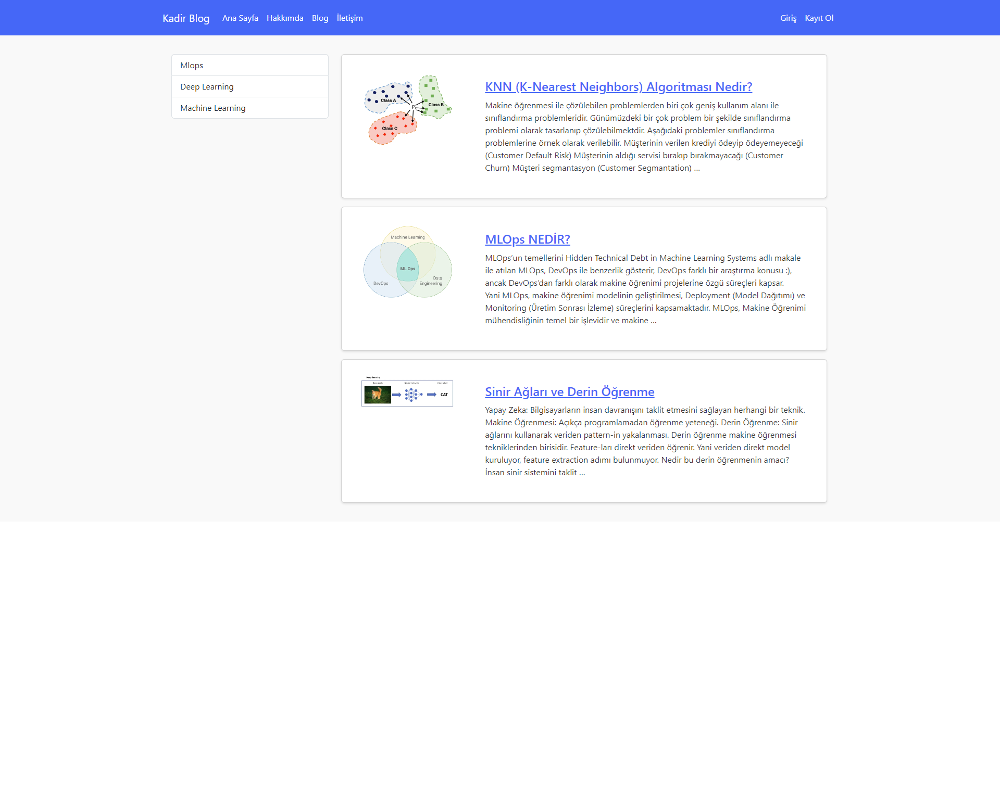

# Blog-Website
This is a Django-based blog application. Follow the steps below to set up and run the project on your local machine.

## Requirements

Ensure you have the following installed:
- Python 3.x
- pillow==10.3.0 
- django==3.2.9
- django-ckeditor==6.7.1

## Installation

1. Clone the repository to your local machine:
   ```sh
   git clone https://github.com/kadiryavuzakinci/Blog-Website.git

2. Navigate to the project directory:
   ```sh 
   cd blogapp

3. Install the required dependencies:

## Setup

1. Apply the migrations:
  
   ```sh
   python manage.py migrate

2. Create a superuser for the admin interface:
    ```sh
    python manage.py createsuperuser

Follow the prompts to set up your admin credentials.

3. Run the development server:
   ```sh
   python manage.py runserver

4. Open your web browser and go to localhost to view the project.

# Features:
- Blog creation and management
- Rich text editing with CKEditor

# Dependencies
- Pillow
- Django
- django-ckeditor

# Screenshot



# License
This project is licensed under the MIT License. See the LICENSE file for more details.